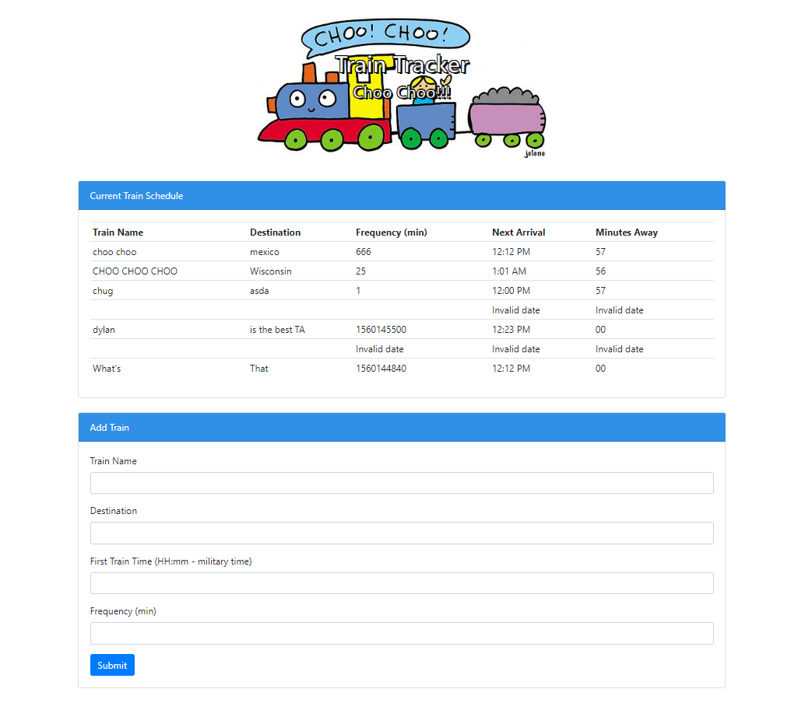

# Train Scheduler Project

## Objective
or our assignment we had to create a train schedule application that would incorporate the Firebase database to host arrival and departure data. The app would have to retrieve and manipulate that information using Moment.js. The website should also provide up-to-date information about various trains, namely their arrival times and how many minutes remain until they arrive at their station. All styling, layout and content was up to us to create.

---

## Instructions

Fill out the Train form, be sure to fill it in as directed. Hit submit, train schedule will update.

---

## Technologies Used
* HTML
* CSS
* Bootstrap
* jQuery
* Javascript
* Moment.js
* Firebase

---

## File Structure

-Root
* index.html
* assets
   * style.css
   * script.js
* images

---

## Deployed Link

[Train Scheduler](https://bwilson1990.github.io/Train-Scheduler/)

---

## Screenshot

